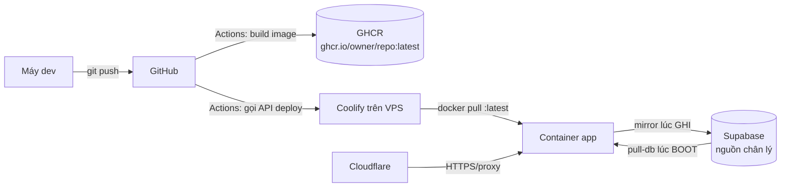

# Playbook Deploy — Next.js → VPS qua CI/CD (Studio làm mẫu, Tutor học theo)

> Gói lại **đúng quy trình đang chạy thật** của Studio (`factory.vietanh.org`) để đội Tutor tái lập.
> Kèm phần **tối ưu tốc độ** (đã áp cho Studio) và cách **điều chỉnh cho monorepo pnpm/turbo của Tutor**.
>
> Tài liệu cũ `DEPLOY.md` mô tả biến thể `docker compose pull` + scp DB — **đã lỗi thời**. Đọc file này.

---

## 1. Kiến trúc — một hình là hiểu



**Nguyên tắc cốt lõi: VPS KHÔNG giữ trạng thái (stateless).**
Dữ liệu thật nằm ở **Supabase** (bảng `studio_kv`). Container lúc **boot** kéo toàn bộ về dựng lại `studio.db`; lúc **ghi** thì mirror ngược lên Supabase. Nhờ đó:
- Redeploy = thay container mới, **không mất gì**, không cần volume/seed DB.
- Rớt VPS/đổi máy chủ → dựng lại từ Supabase trong vài giây.
- Không SSH, không build trên VPS — Coolify chỉ **pull image** đã build sẵn.

---

## 2. Các mảnh ghép & VÌ SAO

| Mảnh | Vai trò | Vì sao chọn vậy |
|---|---|---|
| **Dockerfile 2 tầng** (builder → runner) | Build xong bỏ devDeps, image runtime gọn | Tách cache: đổi source không cài lại deps |
| **Node 24** | Chạy `node:sqlite` **không cần cờ** | Node 22 phải `--experimental-sqlite` |
| **`scripts/pull-db.mjs`** (boot) | Supabase `studio_kv` → `data/studio.db` | Cho VPS stateless |
| **`src/lib/kv-sync.ts`** (mirror) | Ghi thay đổi ngược lên `studio_kv` | Supabase luôn là bản bền |
| **GHCR** | Kho image | Miễn phí theo repo, gắn liền GitHub |
| **Coolify** (resource *Docker Image*) | Kéo `:latest` + chạy + healthcheck + domain | Không cần viết compose/SSH; có UI |
| **Cloudflare** | HTTPS + proxy tên miền | Chứng chỉ tự động, ẩn IP gốc |
| **GitHub Actions** | build+push image, rồi gọi Coolify API | 1 lần push = tự lên VPS |

Điểm tinh tế của Studio (Tutor có thể KHÁC): app **đọc file lúc chạy** bằng `process.cwd()`
(`src/lib/templates/*.typ`, `workers/podcast/*.mp3`, `node_modules/@marp-team/marp-cli`) nên **không**
dùng được `output: "standalone"` — phải giữ trọn `node_modules` + `src`. Tutor nếu không có kiểu đọc file
này thì **nên bật standalone** (mục 5) để image siêu gọn.

---

## 3. Dựng lại từ số 0 (checklist)

### 3.1 GitHub — Secrets & Variables (Settings → Secrets and variables → Actions)
| Loại | Tên | Giá trị |
|---|---|---|
| Variable | `VPS_DEPLOY` | `true` (bật job gọi Coolify) |
| Secret | `COOLIFY_URL` | vd `https://vps.truongvietanh.com` |
| Secret | `COOLIFY_TOKEN` | API token tạo trong Coolify → Keys & Tokens |
| Secret | `COOLIFY_APP_UUID` | UUID resource (trên URL trang resource trong Coolify) |

`GITHUB_TOKEN` có sẵn — dùng đẩy image lên GHCR (workflow đã cấp `packages: write`).

### 3.2 Coolify (trên VPS)
1. **+ New Resource → Docker Image** (KHÔNG phải "from Git" — ta pull image build sẵn).
2. Image: `ghcr.io/<owner>/<repo>:latest`. Nếu package **Private** → thêm Registry Credential (PAT `read:packages`).
3. **Environment variables** (đây là nơi cấu hình runtime, KHÔNG bake vào image):
   - `SUPABASE_URL`, `SUPABASE_SERVICE_KEY` → bật pull-db/mirror (thiếu → app chạy DB local, không đồng bộ).
   - `PORT=3000` (khớp `EXPOSE`).
   - *(khoá AI KHÔNG đặt ở đây — nhập trong app: Cài đặt → OpenRouter, lưu vào DB.)*
4. **Ports/Domain**: gắn domain dạng `https://factory.vietanh.org` (có `https://` để Traefik sinh middleware đúng).
5. **Healthcheck**: đã có trong Dockerfile (`/login`), `start-period` 40s cho kịp boot+pull-db.

### 3.3 Cloudflare
- Bản ghi **A** `factory` → IP VPS, **Proxy = ON** (cam).
- SSL/TLS mode **Full**. Lưu ý timeout Cloudflare **100s** — tác vụ dài (sinh video/podcast) nên chạy nền/tách request kẻo dính lỗi **524**.

### 3.4 Lần đầu
Push nhánh `main`/`master` → tab **Actions** chạy `build-and-deploy` → image lên GHCR → job `deploy` gọi Coolify → Coolify pull & chạy. Mở domain, đăng nhập, vào Cài đặt dán key OpenRouter.

---

## 4. ⭐ TỐI ƯU TỐC ĐỘ (bài học chính — đã áp cho Studio)

Chia 3 mặt trận: **build CI**, **pull về VPS**, **boot**. Cộng lại quyết định "push xong bao lâu thì lên".

### 4.1 Tách layer `node_modules` khỏi code *(đã làm)*
**Vấn đề:** `COPY /app /app` gộp `node_modules` (vài trăm MB, hiếm đổi) chung 1 layer với `.next`/`src`
(đổi mỗi lần). Source đổi → digest layer đổi → VPS **pull lại cả node_modules** mỗi deploy.
**Cách:** copy tách theo tần suất đổi, `node_modules` đứng riêng:
```dockerfile
COPY --from=builder /app/node_modules ./node_modules   # layer bền → deploy sau TÁI DÙNG, không pull lại
COPY --from=builder /app/.next ./.next
COPY --from=builder /app/public ./public
COPY --from=builder /app/src ./src
COPY --from=builder /app/scripts ./scripts
COPY --from=builder /app/workers ./workers
COPY --from=builder /app/package.json /app/next.config.ts ./
```
**Lợi:** deploy chỉ-đổi-code → VPS chỉ pull `.next`+`src` (nhỏ), bỏ qua `node_modules`. Nhanh hơn nhiều lần.
**Bẫy:** phải copy ĐÚNG mọi thứ runtime cần. Quét trước bằng `grep -rn "process.cwd()" src` để không sót.

### 4.2 Bỏ `.next/cache` khỏi image *(đã làm)*
Build-cache của Turbopack (hàng trăm MB) **vô dụng lúc `next start`**. Cắt ngay sau build:
```dockerfile
RUN npm run build && rm -rf .next/cache && npm prune --omit=dev
```
**Lợi:** image nhẹ đi đáng kể → pull nhanh + đỡ tốn dung lượng GHCR/VPS.

### 4.3 `provenance:false` + 1 kiến trúc *(đã làm)*
```yaml
platforms: linux/amd64   # VPS amd64 — tránh lỡ build đa-arch (emulate) rất chậm
provenance: false        # bỏ SLSA attestation → manifest ĐƠN, Coolify/docker pull gọn
```
Mặc định `build-push-action` bật provenance → sinh **manifest list** kèm attestation, pull rườm rà.

### 4.4 Docker layer cache trên CI *(đã có)*
```yaml
cache-from: type=gha
cache-to: type=gha,mode=max
```
Layer nặng (apt cài chromium/ffmpeg/typst, `npm ci`) chỉ chạy lại khi Dockerfile/lock đổi. `mode=max` cache cả layer trung gian.

### 4.5 `pull-db` bắn SONG SONG *(đã làm)*
**Vấn đề:** boot kéo 34.917 dòng = ~35 trang REST **tuần tự** tới `ap-southeast-1` → cộng dồn nhiều giây, mỗi lần khởi động container.
**Cách:** lấy tổng số dòng qua `Prefer: count=exact` (header `Content-Range`), rồi bắn các trang còn lại song song (pool 8):
```js
const first = await fetch(`${REST}?${sel}&limit=1000&offset=0`, { headers: { ...H, Prefer: "count=exact" } });
const total = Number(first.headers.get("content-range")?.split("/")[1]);
// tính offset còn lại → Promise.all với concurrency 8, ghép theo thứ tự
```
**Lợi:** boot nhanh hơn nhiều lần = giảm downtime mỗi redeploy.

### 4.6 (Nâng cao) Base image dựng sẵn — *khuyến nghị cho Tutor, Studio làm sau khi test staging*
Layer apt (chromium/ffmpeg/typst/python) hiếm đổi nhưng nặng. Tách ra **1 image nền** build 1 lần, đẩy GHCR:
```dockerfile
# Dockerfile.base → ghcr.io/<owner>/studio-base:1
FROM node:24-bookworm-slim
RUN apt-get update && apt-get install -y --no-install-recommends chromium ffmpeg python3 ... && ...
```
App Dockerfile: `FROM ghcr.io/<owner>/studio-base:1 AS runner`. CI app **bỏ hẳn** bước cài nặng → build ngắn hẳn. Đổi bộ binary mới bump tag base.

---

## 5. Áp cho TUTOR (monorepo pnpm + turbo)

Khác Studio (npm, 1 app). Điều chỉnh:

### 5.1 Bật Next **standalone** — đòn lớn nhất
Nếu app Tutor **không** đọc file runtime kiểu Studio, thêm vào `next.config`:
```ts
const nextConfig = { output: "standalone" };
```
→ `next build` gói sẵn `.next/standalone` (chỉ deps thực sự dùng, đã tree-shake) + tự chạy `node server.js`.
Dockerfile runner chỉ cần **3 dòng copy**, image gọn còn ~1/5:
```dockerfile
COPY --from=builder /app/apps/web/.next/standalone ./
COPY --from=builder /app/apps/web/.next/static ./apps/web/.next/static
COPY --from=builder /app/apps/web/public ./apps/web/public
CMD ["node", "apps/web/server.js"]
```

### 5.2 pnpm — cài nhanh & cache chuẩn
```dockerfile
# corepack có sẵn trong node:24
RUN corepack enable
COPY pnpm-lock.yaml package.json pnpm-workspace.yaml ./
COPY apps/web/package.json apps/web/
# cache store pnpm giữa các lần build
RUN --mount=type=cache,id=pnpm,target=/root/.local/share/pnpm/store \
    pnpm install --frozen-lockfile --filter web...
COPY . .
RUN pnpm --filter web build
```
`--filter web...` chỉ cài deps của app web + phụ thuộc workspace của nó, bỏ app khác.

### 5.3 turbo — chỉ build phần đổi
- `turbo build --filter=web` để chạy đúng task cần.
- Bật **remote cache** (Vercel free hoặc tự host `turbo` cache trên S3/R2): CI lần sau **tải kết quả cache**, bỏ qua build package không đổi. Đây là đòn tăng tốc CI mạnh nhất cho monorepo.

### 5.4 Những thứ dùng CHUNG với Studio
Áp y hệt mục 4: layer cache `type=gha`, `provenance:false`, tách `node_modules`/standalone, `platforms: linux/amd64`, Coolify *Docker Image* + env runtime, Cloudflare proxy + lưu ý 524.

---

## 6. Vận hành & sự cố nhanh

| Triệu chứng | Xử lý |
|---|---|
| Push xong không thấy deploy | `VPS_DEPLOY` chưa `true`, hoặc thiếu 3 secret Coolify. Xem log job `deploy`. |
| Coolify "no available server" | Domain thiếu `https://` → middleware Traefik sai. Sửa thành `https://<domain>`. |
| Tác vụ dài lỗi `524`/`<!DOCTYPE` | Cloudflare timeout 100s. Chạy nền hoặc tách request. |
| App rỗng dữ liệu | Thiếu `SUPABASE_URL`/`SUPABASE_SERVICE_KEY` → pull-db bỏ qua. Kiểm env Coolify. |
| `node:sqlite` đòi cờ | Image không phải Node ≥ 23. Dùng `node:24-*`. |
| `docker pull ... denied` | Package Private, Coolify thiếu Registry Credential (PAT `read:packages`). |

---

## 7. Tóm tắt file liên quan (Studio)
- `Dockerfile` — 2 tầng, Node 24, binary nặng, tách layer, healthcheck, `tini`.
- `.dockerignore` — chặn `node_modules`/`.next`/`data`/`*.exe`/secrets khỏi build context.
- `.github/workflows/deploy.yml` — build+push GHCR, cache gha, job `deploy` gọi Coolify API.
- `scripts/pull-db.mjs` — boot: Supabase → `studio.db` (song song).
- `src/lib/kv-sync.ts` — mirror: ghi → Supabase `studio_kv` (gated bằng env).
