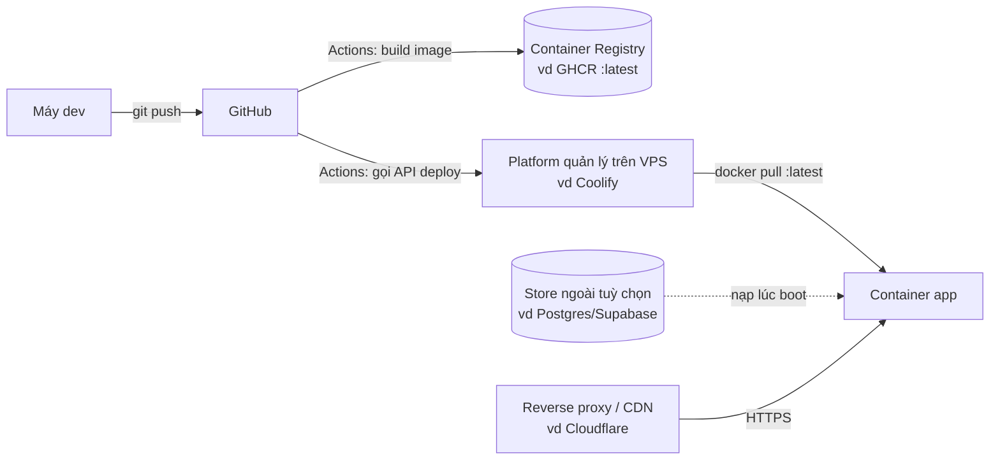

# Playbook Deploy — Web app → VPS qua CI/CD (công thức chung, app nào cũng áp được)

> Công thức deploy **một app web (container) lên VPS tự động khi push code**, viết ở dạng **chung** —
> thay placeholder `<...>` là dùng được cho mọi dự án (Next.js, Node, hay bất kỳ image nào).
> Kèm phần **tối ưu tốc độ** và **các biến thể theo loại app** (monorepo, app đọc file runtime, app cần binary hệ thống).

Placeholder dùng xuyên suốt: `<owner>/<repo>` (GitHub), `<your-domain>` (tên miền), `<APP_PORT>` (cổng app, ví dụ 3000).

---

## 1. Kiến trúc — một hình là hiểu



**Nguyên tắc vàng: container KHÔNG tự build trên VPS, KHÔNG giữ trạng thái sống-còn.**
- CI **build sẵn** image, đẩy lên registry. VPS chỉ **pull + chạy** → deploy nhanh, VPS nhẹ.
- State (DB/file) để ở **volume** hoặc **store ngoài**. Redeploy = thay container, **không mất dữ liệu**.
- (Tuỳ chọn nâng cao) muốn VPS **stateless hoàn toàn**: để state ở DB ngoài, container **nạp lúc boot** — rớt máy/đổi VPS dựng lại trong vài giây (xem §6.4).

---

## 2. Các mảnh ghép & VÌ SAO

| Mảnh | Vai trò | Vì sao |
|---|---|---|
| **Dockerfile 2 tầng** (builder → runner) | Build xong bỏ devDeps, image runtime gọn | Tách cache: đổi source không cài lại deps |
| **Container Registry** (GHCR/Docker Hub/GitLab) | Kho image | GHCR miễn phí gắn liền GitHub repo |
| **Platform trên VPS** (Coolify/Dokploy/Portainer) | Pull image + chạy + healthcheck + domain + TLS | Không cần tự viết compose/SSH; có UI, có API deploy |
| **CI** (GitHub Actions) | build+push image, rồi gọi API deploy | 1 push = tự lên VPS, không thao tác tay |
| **Reverse proxy/CDN** (Cloudflare/Caddy) | HTTPS + tên miền + ẩn IP gốc | Chứng chỉ tự động |

> Vì sao **Coolify (resource kiểu "Docker Image")** thay vì "build from Git": để **CI build**, VPS chỉ pull.
> Build trên VPS ăn CPU/RAM của chính máy chạy app và chậm. Tách ra → deploy = pull vài trăm MB là xong.

---

## 3. Dựng từ số 0 (checklist)

### 3.1 Registry & CI secrets (GitHub → Settings → Secrets and variables → Actions)
| Loại | Tên | Giá trị |
|---|---|---|
| Variable | `DEPLOY_ON` | `true` (bật job gọi platform) |
| Secret | `DEPLOY_HOOK_URL` | URL/endpoint deploy của platform (Coolify: `<platform-url>`) |
| Secret | `DEPLOY_TOKEN` | API token của platform |
| Secret | `DEPLOY_APP_ID` | ID/UUID app trên platform |

Đẩy image lên GHCR dùng `GITHUB_TOKEN` sẵn có (cấp `packages: write` trong workflow) — không cần secret riêng.

### 3.2 Platform trên VPS (ví dụ Coolify)
1. **+ New Resource → Docker Image** (KHÔNG phải "from Git").
2. Image: `ghcr.io/<owner>/<repo>:latest`. Registry Private → thêm Registry Credential (token quyền đọc packages).
3. **Environment variables**: đặt cấu hình runtime ở ĐÂY (không bake secret vào image) — DB URL, khoá dịch vụ, `PORT=<APP_PORT>`.
4. **Domain**: gắn `https://<your-domain>` (có `https://` để proxy sinh middleware đúng).
5. **Healthcheck**: đã có trong Dockerfile (§4). `start-period` đủ dài cho app boot.

### 3.3 Tên miền + TLS (ví dụ Cloudflare)
- Bản ghi **A** `<your-domain>` → IP VPS, **Proxy = ON**.
- SSL/TLS mode **Full**. Lưu ý **timeout ~100s** của Cloudflare → tác vụ dài (báo cáo nặng, sinh media) nên **chạy nền/tách request** kẻo dính lỗi **524**.

### 3.4 Lần đầu
Push nhánh chính → tab **Actions** build → image lên registry → job deploy gọi platform → platform pull & chạy. Mở `https://<your-domain>`.

---

## 4. File mẫu (copy-paste, thay placeholder)

### `Dockerfile` — 2 tầng, tách layer, healthcheck
```dockerfile
# syntax=docker/dockerfile:1
ARG NODE_IMAGE=node:24-bookworm-slim

# ── build ──
FROM ${NODE_IMAGE} AS builder
WORKDIR /app
COPY package.json package-lock.json ./
RUN npm ci                         # layer này chỉ chạy lại khi lock đổi
COPY . .
RUN npm run build \
 && rm -rf .next/cache \           # build-cache vô dụng lúc chạy → bỏ khỏi image
 && npm prune --omit=dev           # cắt devDeps cho runtime gọn

# ── runtime ──
FROM ${NODE_IMAGE} AS runner
WORKDIR /app
ENV NODE_ENV=production PORT=<APP_PORT>
# (Nếu app cần binary hệ thống — chromium, ffmpeg… — cài ở đây, xem §6.3)

# Copy TÁCH LAYER theo tần suất đổi → deploy incremental chỉ pull layer đã đổi:
COPY --from=builder /app/node_modules ./node_modules   # nặng, hiếm đổi → VPS TÁI DÙNG
COPY --from=builder /app/.next ./.next
COPY --from=builder /app/public ./public
COPY --from=builder /app/package.json ./
# (chỉ copy thêm thứ RUNTIME thật cần — quét trước: grep -rn "process.cwd()" src)

EXPOSE <APP_PORT>
HEALTHCHECK --interval=30s --timeout=5s --start-period=30s --retries=3 \
  CMD node -e "fetch('http://127.0.0.1:'+(process.env.PORT||<APP_PORT>)+'/').then(r=>process.exit(r.ok?0:1)).catch(()=>process.exit(1))"
CMD ["npm", "run", "start"]
```

### `.github/workflows/deploy.yml`
```yaml
name: build-and-deploy
on:
  push: { branches: [main, master] }
  workflow_dispatch: {}
concurrency: { group: deploy-${{ github.ref }}, cancel-in-progress: true }

jobs:
  build-and-push:
    runs-on: ubuntu-latest
    permissions: { contents: read, packages: write }
    steps:
      - uses: actions/checkout@v4
      - uses: docker/login-action@v3
        with: { registry: ghcr.io, username: ${{ github.actor }}, password: ${{ secrets.GITHUB_TOKEN }} }
      - id: meta
        uses: docker/metadata-action@v5
        with:
          images: ghcr.io/${{ github.repository }}
          tags: |
            type=raw,value=latest
            type=sha,format=long
      - uses: docker/setup-buildx-action@v3
      - uses: docker/build-push-action@v6
        with:
          context: .
          push: true
          platforms: linux/amd64      # chốt 1 kiến trúc (VPS amd64) — tránh build đa-arch chậm
          provenance: false           # manifest ĐƠN → pull gọn
          tags: ${{ steps.meta.outputs.tags }}
          cache-from: type=gha        # cache layer giữa các lần build
          cache-to: type=gha,mode=max

  deploy:
    needs: build-and-push
    runs-on: ubuntu-latest
    if: ${{ vars.DEPLOY_ON == 'true' }}
    steps:
      - run: |
          curl -fsS -X POST \
            "${{ secrets.DEPLOY_HOOK_URL }}/api/v1/deploy?uuid=${{ secrets.DEPLOY_APP_ID }}&force=true" \
            -H "Authorization: Bearer ${{ secrets.DEPLOY_TOKEN }}"
```

### `.dockerignore`
```
node_modules
.next
out
data                # state runtime — không bake vào image
.env
.env.*
.git
.github
*.md
.DS_Store
Thumbs.db
```

---

## 5. ⭐ TỐI ƯU TỐC ĐỘ

3 mặt trận: **build CI · pull về VPS · boot**. Cộng lại = "push xong bao lâu thì lên".

| # | Đòn | Vấn đề | Cách | Lợi |
|---|---|---|---|---|
| 1 | **Tách layer `node_modules`** | Gộp deps (nặng, hiếm đổi) chung code → deploy nào cũng pull lại vài trăm MB | Copy `node_modules` thành layer RIÊNG, trước code (§4) | Đổi-code → VPS tái dùng layer deps, chỉ pull phần nhỏ |
| 2 | **Bỏ build-cache khỏi image** | `.next/cache` (Turbopack/webpack) hàng trăm MB, vô dụng runtime | `rm -rf .next/cache` sau build | Image nhẹ → pull nhanh |
| 3 | **Copy có chọn lọc** | `COPY /app /app` gói cả rác (docs, config dev) | Chỉ copy thứ runtime cần (quét `process.cwd()`) | Image gọn thêm |
| 4 | **`provenance:false` + 1 kiến trúc** | Mặc định sinh manifest-list + attestation → pull rườm rà | `provenance:false`, `platforms:linux/amd64` | Manifest đơn, pull gọn |
| 5 | **Docker layer cache CI** | Cài deps/apt chạy lại mỗi build | `cache-from/to: type=gha,mode=max` | Layer nặng chỉ chạy lại khi đổi thật |
| 6 | **Base image dựng sẵn** *(nếu app cần binary nặng)* | Layer apt (chromium/ffmpeg…) nặng, hiếm đổi nhưng build lại tốn | Build 1 `Dockerfile.base` đẩy registry; app `FROM <base>` | CI app bỏ hẳn bước cài nặng |
| 7 | **Boot nạp DB song song** *(nếu dùng stateless §6.4)* | Kéo nhiều trang tuần tự lúc boot | Lấy tổng số (count) rồi bắn song song (pool ~8) | Boot nhanh nhiều lần |

> **Đòn số 1 áp dụng cho MỌI app** và thường lãi nhất cho deploy hằng ngày (chỉ code đổi, deps thì không).

---

## 6. Biến thể theo loại app

### 6.1 Next.js **standalone** — đòn lớn nhất nếu app KHÔNG đọc file runtime
Thêm `output: "standalone"` vào `next.config` → build gói sẵn deps thực dùng (đã tree-shake) + `server.js`. Runner chỉ 3 dòng copy, image gọn còn ~1/5:
```dockerfile
COPY --from=builder /app/.next/standalone ./
COPY --from=builder /app/.next/static ./.next/static
COPY --from=builder /app/public ./public
CMD ["node", "server.js"]
```
> **KHÔNG dùng standalone** nếu app đọc file lúc chạy bằng `process.cwd()` (template, asset, binary trong node_modules) — tracing sẽ bỏ sót. Khi đó giữ cách tách-layer ở §4.

### 6.2 Monorepo (pnpm + turbo)
```dockerfile
RUN corepack enable
COPY pnpm-lock.yaml package.json pnpm-workspace.yaml ./
COPY <app>/package.json <app>/
RUN --mount=type=cache,id=pnpm,target=/root/.local/share/pnpm/store \
    pnpm install --frozen-lockfile --filter <app>...   # chỉ deps của app cần
COPY . .
RUN pnpm --filter <app> build
```
- `--filter <app>...` bỏ qua app/package khác trong workspace.
- **turbo remote cache** (Vercel free hoặc tự host S3/R2): CI lần sau tải kết quả cache, bỏ qua build package không đổi → **đòn tăng tốc CI mạnh nhất cho monorepo**.

### 6.3 App cần binary hệ thống (chromium, ffmpeg, typst…)
Cài ở tầng runner. Nếu nặng và hiếm đổi → tách **base image** (§5 đòn 6): build 1 lần, đẩy registry, app `FROM <base>` → CI app không cài lại mỗi lần.

### 6.4 VPS stateless qua DB ngoài (tuỳ chọn nâng cao)
Để state ở DB ngoài (Postgres/Supabase). Container **boot** kéo về dựng DB local; **ghi** thì mirror ngược lên (gated bằng env — thiếu env thì chạy DB local như thường). Script boot chạy trước lệnh start:
```dockerfile
CMD ["sh", "-c", "node scripts/pull-state.mjs && npm run start"]
```
Nạp nhiều dòng → **song song hoá** (lấy tổng qua `count`, bắn các trang bằng pool ~8) để boot nhanh (§5 đòn 7).

---

## 7. Vận hành & sự cố nhanh

| Triệu chứng | Xử lý |
|---|---|
| Push xong không deploy | `DEPLOY_ON` chưa `true`, hoặc thiếu secret platform. Xem log job `deploy`. |
| Proxy "no available server" | Domain thiếu `https://` → middleware sai. Sửa thành `https://<your-domain>`. |
| Tác vụ dài lỗi `524` | CDN timeout (~100s). Chạy nền hoặc tách request. |
| `docker pull ... denied` | Registry Private, platform thiếu credential đọc packages. |
| Image quá nặng, pull lâu | Áp §5 (tách layer, bỏ cache, standalone nếu được). |
| Deps cài lại mỗi CI | Đảm bảo copy lockfile TRƯỚC source; bật `cache-from/to`. |

---

## 8. Tóm tắt "công thức tối thiểu"
1. `Dockerfile` 2 tầng + tách layer + healthcheck (§4).
2. Workflow build→push GHCR + job deploy gọi platform (§4).
3. Platform kiểu **Docker Image** pull `:latest`, env runtime, domain HTTPS (§3).
4. Áp §5 đòn 1–5 cho mọi app; thêm 6–7 nếu app nặng/stateless.
5. State ở volume hoặc DB ngoài — **không bao giờ** bake vào image.
